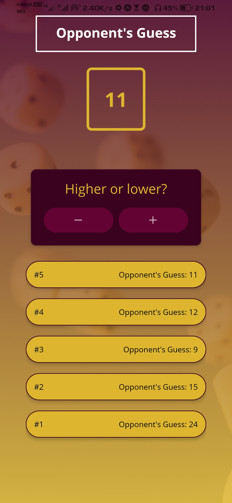
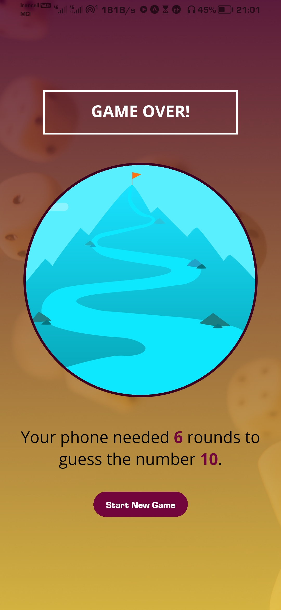

<h1 align='center' style="font-size:5rem"><b>Guess Number Game</b></h1>

   
<h2 align='center'>
    You have to choose a number and confirm it, then the machine will try to guess that number and you have to help it with this process. Enjoy the game :)
</h2>

   

    <h2>First Page</h2>
    </img>

    <h2>Guess Page</h2>
    </img>

    <h2>Guess Page</h2>
    </img>

    

<h1 align='center'><b>Abilities</b></h1>

<ul>
    <li> Its just a simple game for mobile with react native...</li>
</ul>

    
<h1 align='center'><b>Language and technologies used in This Project</h1>

    

<h1 align='center'><b>Requirements</b></h1>

Download and install `NodeJS` from official website <a href="https://nodejs.org/">nodeJS.org</a>

    

<h1 align='center'><b>How To Run</b></h1>

At first you have to clone the project and open it in `IDE`

 

Open IDE's terminal and then write `~ npm i` to install dependencies

 

Then write `~ npm start` and then enter

Congratulations ,now you can use this page for your beautiful project.
